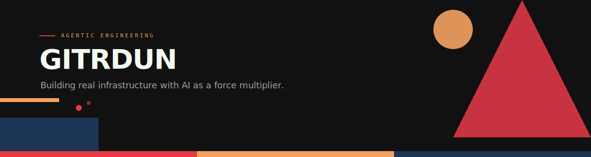

<picture>
  
</picture>

<br>

<table>
<tr>
<td width="60%">

### What we build

Tools for engineers who ship. AI-augmented development infrastructure — deterministic code review, agentic orchestration, fleet management. No magic, no vendor lock-in, no LLM in the decision path unless it earns its seat.

Everything here is built from real projects, tested in real environments, and documented honestly.

</td>
<td width="40%">

```
 ╔══════════════════════════╗
 ║   EDMONTON, ALBERTA      ║
 ║                          ║
 ║   AWS ─── CLOUD ARCH     ║
 ║   AI  ─── AGENTIC ENG    ║
 ║   OPS ─── INFRA AUTO     ║
 ║                          ║
 ║   "Getting IT Done"      ║
 ╚══════════════════════════╝
```

</td>
</tr>
</table>

---

**`PROJECTS`**

| | Repository | What it does |
|---|---|---|
| **`01`** | [**eedom**](https://github.com/gitrdunhq/eedom) | Deterministic code & dependency review for CI. 15 plugins, zero LLM in the decision path. |
| **`02`** | [**eedom-community-rules**](https://github.com/gitrdunhq/eedom-community-rules) | Community rules and configs for eedom. Drop-in scanner policies. |

---

**`LINKS`**

<a href="https://gitrdun.net"><code>gitrdun.net</code></a> · <a href="https://blog.gitrdun.net"><code>blog.gitrdun.net</code></a> · <a href="https://www.linkedin.com/in/samfakhreddine/"><code>linkedin</code></a> · <a href="https://github.com/sam-fakhreddine"><code>@sam-fakhreddine</code></a>

<br>

<sub>Built with Claude Code · Bauhaus design system · League Spartan + DM Sans + Space Mono</sub>
